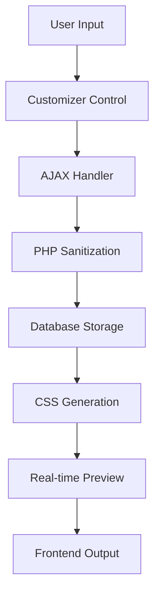

# 👨‍💻 Manual do Desenvolvedor - Tema UENF Geral

> **Documentação técnica completa para desenvolvedores que trabalham com o Design System CCT**

## 🎯 Visão Geral Técnica

O **Tema UENF Geral** é uma aplicação WordPress enterprise que implementa um **Design System CCT (Custom Customizer Toolkit)** completo. Esta documentação fornece informações técnicas detalhadas para desenvolvedores.

### 🏗️ **Arquitetura do Sistema**

```
Tema UENF Geral
├── Frontend (WordPress Theme)
│   ├── Templates PHP
│   ├── Styles (SCSS → CSS)
│   └── Scripts (ES6+ → JS)
├── Backend (WordPress Customizer API)
│   ├── Custom Controls
│   ├── Settings Management
│   └── AJAX Handlers
├── Design System CCT
│   ├── 12 Módulos Integrados
│   ├── Real-time Preview
│   └── Token Management
└── Build System
    ├── Webpack/Gulp
    ├── SCSS Compilation
    └── JS Transpilation
```

---

## 🔧 Configuração do Ambiente

### 📋 **Pré-requisitos**

```bash
# Versões mínimas
Node.js >= 16.0.0
npm >= 8.0.0
PHP >= 7.4
WordPress >= 6.0
Composer >= 2.0
```

### 🚀 **Setup Inicial**

```bash
# Clone do repositório
git clone https://github.com/edsonuenf/uenf-geral.git
cd uenf-geral

# Instalar dependências Node.js
npm install

# Instalar dependências PHP
composer install

# Build inicial
npm run build
```

### 🛠️ **Scripts Disponíveis**

```json
{
  "scripts": {
    "dev": "webpack --mode=development",
    "build": "webpack --mode=production",
    "watch": "webpack --mode=development --watch",
    "lint:js": "eslint js/**/*.js",
    "lint:css": "stylelint css/**/*.css"
  }
}
```

---

## 🏛️ Arquitetura do Código

### 📁 **Estrutura de Diretórios**

```
uenf-geral/
├── css/                    # Arquivos CSS (raiz)
│   ├── components/         # CSS de componentes
│   ├── layout/             # CSS de layout
│   └── style.css           # CSS principal
├── js/                     # JavaScript (raiz)
│   ├── main.js             # Entry point
│   └── *.js                # Módulos JS compilados/fonte
├── inc/                    # Include PHP
│   └── customizer/         # Módulos do Customizer CCT
│       ├── class-*-manager.php
│       ├── class-*-controls.php
│       └── customizer-loader.php
├── assets/                 # Assets estáticos (imagens, fonts)
└── style.css               # Metadados do tema
```

### 🎨 **Design System CCT - Arquitetura**

#### **Core Classes**

```php
<?php
/**
 * Classe principal do carregador do customizer
 */
class CCT_Customizer_Loader {
    private static $instance = null;
    private $modules = array();
    
    public static function get_instance() {
        if (self::$instance === null) {
            self::$instance = new self();
        }
        return self::$instance;
    }

    // ... init, load_modules ...
}
```

#### **Module Interface**

```php
<?php
interface CCT_Module_Interface {
    public function register_controls($wp_customize);
    public function enqueue_scripts();
    public function enqueue_styles();
    public function get_default_settings();
    public function sanitize_settings($input);
    public function generate_css();
}
```

### 🔄 **Fluxo de Dados**



---

## 🎨 Módulos do Design System

### 🎯 **1. Sistema de Cores (CCT_Colors)**

#### **Estrutura de Dados**

```php
$color_settings = [
    'palettes' => [
        'primary' => '#0066CC',
        'secondary' => '#004499',
        'accent' => '#FF6600',
        'neutral' => [
            'white' => '#FFFFFF',
            'gray-100' => '#F8F9FA',
            'gray-900' => '#212529',
            'black' => '#000000'
        ]
    ],
    'accessibility' => [
        'contrast_ratio' => 4.5,
        'wcag_level' => 'AA'
    ]
];
```

#### **API JavaScript**

```javascript
class CCTColors {
    constructor() {
        this.palettes = new Map();
        this.init();
    }
    
    setPalette(name, colors) {
        this.palettes.set(name, colors);
        this.updateCSS();
        this.triggerChange();
    }
    
    checkContrast(foreground, background) {
        return this.calculateContrastRatio(foreground, background);
    }
    
    generateCSS() {
        return this.palettes.entries().map(([name, colors]) => 
            this.generateCSSVariables(name, colors)
        ).join('\n');
    }
}
```

### 🔤 **2. Sistema de Tipografia (CCT_Typography)**

#### **Font Management**

```javascript
class CCTTypography {
    constructor() {
        this.fonts = new Map();
        this.loadGoogleFonts();
    }
    
    async loadGoogleFonts() {
        const response = await fetch('https://www.googleapis.com/webfonts/v1/webfonts?key=' + this.apiKey);
        const data = await response.json();
        this.processFonts(data.items);
    }
    
    generateFontCSS(fontFamily, variants) {
        return `
            @import url('https://fonts.googleapis.com/css2?family=${fontFamily}:wght@${variants.join(';')}&display=swap');
            
            :root {
                --font-${fontFamily.toLowerCase()}: '${fontFamily}', sans-serif;
            }
        `;
    }
}
```

### 🏗️ **3. Sistema de Layout (CCT_Layout)**

#### **Grid System**

```scss
// Grid Mixins
@mixin make-container($max-width: 1200px) {
    width: 100%;
    max-width: $max-width;
    margin: 0 auto;
    padding: 0 var(--container-padding, 1rem);
}

@mixin make-grid($columns: 12, $gap: 1rem) {
    display: grid;
    grid-template-columns: repeat($columns, 1fr);
    gap: $gap;
}

// Responsive Breakpoints
$breakpoints: (
    'mobile': 768px,
    'tablet': 1024px,
    'desktop': 1200px,
    'wide': 1400px
);

@mixin respond-to($breakpoint) {
    @media (min-width: map-get($breakpoints, $breakpoint)) {
        @content;
    }
}
```

### 📱 **4. Sistema de Breakpoints (CCT_Breakpoints)**

#### **Responsive Manager**

```javascript
class CCTBreakpoints {
    constructor() {
        this.breakpoints = new Map();
        this.observers = new Set();
        this.init();
    }
    
    setBreakpoint(name, value) {
        this.breakpoints.set(name, value);
        this.updateCSS();
        this.notifyObservers();
    }
    
    getCurrentBreakpoint() {
        const width = window.innerWidth;
        for (const [name, value] of this.breakpoints) {
            if (width <= value) return name;
        }
        return 'wide';
    }
    
    observeBreakpointChanges(callback) {
        this.observers.add(callback);
        
        // ResizeObserver para performance
        if (!this.resizeObserver) {
            this.resizeObserver = new ResizeObserver(() => {
                this.notifyObservers();
            });
            this.resizeObserver.observe(document.body);
        }
    }
}
```

---

## 🔌 APIs e Integrações

### 🎛️ **Customizer API Extensions**

#### **Custom Control Base**

```php
<?php
class CCT_Custom_Control extends WP_Customize_Control {
    public $type = 'cct_custom';
    public $module = '';
    public $preview_js = '';
    
    public function enqueue() {
        wp_enqueue_script(
            'cct-' . $this->module . '-control',
            get_template_directory_uri() . '/js/' . $this->module . '-control.js',
            ['customize-controls', 'jquery'],
            '1.0.0',
            true
        );
        
        if ($this->preview_js) {
            wp_enqueue_script(
                'cct-' . $this->module . '-preview',
                get_template_directory_uri() . '/js/' . $this->preview_js,
                ['customize-preview', 'jquery'],
                '1.0.0',
                true
            );
        }
    }
    
    protected function render_content() {
        ?>
        <div class="cct-control cct-<?php echo esc_attr($this->module); ?>-control">
            <?php $this->render_module_content(); ?>
        </div>
        <?php
    }
    
    abstract protected function render_module_content();
}
```

#### **AJAX Handlers**

```php
<?php
class CCT_AJAX_Handler {
    public function __construct() {
        add_action('wp_ajax_cct_save_settings', [$this, 'save_settings']);
        add_action('wp_ajax_cct_export_settings', [$this, 'export_settings']);
        add_action('wp_ajax_cct_import_settings', [$this, 'import_settings']);
        add_action('wp_ajax_cct_generate_css', [$this, 'generate_css']);
    }
    
    public function save_settings() {
        check_ajax_referer('cct_nonce', 'nonce');
        
        if (!current_user_can('customize')) {
            wp_die('Unauthorized');
        }
        
        $settings = $this->sanitize_settings($_POST['settings']);
        $result = $this->store_settings($settings);
        
        wp_send_json_success($result);
    }
    
    private function sanitize_settings($settings) {
        // Implementar sanitização específica por módulo
        return array_map([$this, 'sanitize_setting'], $settings);
    }
}
```

### 🔄 **Real-time Preview System**

#### **Preview Manager**

```javascript
class CCTPreviewManager {
    constructor() {
        this.modules = new Map();
        this.debounceTime = 300;
        this.init();
    }
    
    registerModule(name, module) {
        this.modules.set(name, module);
        this.bindEvents(name, module);
    }
    
    bindEvents(name, module) {
        wp.customize(module.settings, (value) => {
            value.bind(this.debounce((newValue) => {
                this.updatePreview(name, newValue);
            }, this.debounceTime));
        });
    }
    
    updatePreview(moduleName, settings) {
        const module = this.modules.get(moduleName);
        if (module && module.updatePreview) {
            module.updatePreview(settings);
        }
        
        // Trigger global update event
        document.dispatchEvent(new CustomEvent('cct:previewUpdate', {
            detail: { module: moduleName, settings }
        }));
    }
    
    debounce(func, wait) {
        let timeout;
        return function executedFunction(...args) {
            const later = () => {
                clearTimeout(timeout);
                func(...args);
            };
            clearTimeout(timeout);
            timeout = setTimeout(later, wait);
        };
    }
}
```

---

## 🧪 Testes e Qualidade

### 🔍 **Estrutura de Testes**

```
tests/
├── unit/                   # Testes unitários
│   ├── php/               # PHPUnit tests
│   └── js/                # Jest tests
├── integration/           # Testes de integração
├── e2e/                   # Testes end-to-end
└── fixtures/              # Dados de teste
```

### 🧪 **Testes JavaScript (Jest)**

```javascript
// tests/unit/js/cct-colors.test.js
import CCTColors from '../../../src/js/modules/cct-colors';

describe('CCTColors', () => {
    let cctColors;
    
    beforeEach(() => {
        cctColors = new CCTColors();
    });
    
    test('should calculate contrast ratio correctly', () => {
        const ratio = cctColors.checkContrast('#000000', '#FFFFFF');
        expect(ratio).toBe(21);
    });
    
    test('should generate valid CSS variables', () => {
        cctColors.setPalette('primary', {
            main: '#0066CC',
            light: '#3388DD',
            dark: '#004499'
        });
        
        const css = cctColors.generateCSS();
        expect(css).toContain('--color-primary-main: #0066CC');
    });
});
```

### 🧪 **Testes PHP (PHPUnit)**

```php
<?php
// tests/unit/php/CCTColorsTest.php
class CCTColorsTest extends WP_UnitTestCase {
    private $cct_colors;
    
    public function setUp(): void {
        parent::setUp();
        $this->cct_colors = new CCT_Colors();
    }
    
    public function test_sanitize_color() {
        $valid_color = '#FF0000';
        $result = $this->cct_colors->sanitize_color($valid_color);
        $this->assertEquals($valid_color, $result);
        
        $invalid_color = 'invalid';
        $result = $this->cct_colors->sanitize_color($invalid_color);
        $this->assertEquals('#000000', $result);
    }
    
    public function test_generate_palette_css() {
        $palette = [
            'primary' => '#0066CC',
            'secondary' => '#004499'
        ];
        
        $css = $this->cct_colors->generate_palette_css($palette);
        $this->assertStringContainsString('--color-primary', $css);
    }
}
```

### 📊 **Code Quality Tools**

```json
{
  "scripts": {
    "lint:js": "eslint src/js/**/*.js --fix",
    "lint:css": "stylelint src/scss/**/*.scss --fix",
    "lint:php": "phpcs --standard=WordPress-Extra .",
    "test:coverage": "jest --coverage",
    "analyze": "webpack-bundle-analyzer dist/js/bundle.js"
  }
}
```

---

## 🚀 Performance e Otimização

### ⚡ **Estratégias de Performance**

#### **Lazy Loading**

```javascript
class CCTLazyLoader {
    constructor() {
        this.modules = new Map();
        this.loadedModules = new Set();
    }
    
    registerModule(name, loader) {
        this.modules.set(name, loader);
    }
    
    async loadModule(name) {
        if (this.loadedModules.has(name)) {
            return this.modules.get(name);
        }
        
        const loader = this.modules.get(name);
        if (loader) {
            const module = await loader();
            this.loadedModules.add(name);
            return module;
        }
    }
    
    // Intersection Observer para carregamento sob demanda
    observeElement(element, moduleName) {
        const observer = new IntersectionObserver((entries) => {
            entries.forEach(entry => {
                if (entry.isIntersecting) {
                    this.loadModule(moduleName);
                    observer.unobserve(entry.target);
                }
            });
        });
        
        observer.observe(element);
    }
}
```

#### **Cache System**

```php
<?php
class CCT_Cache {
    private $cache_group = 'cct_design_system';
    private $cache_expiry = 3600; // 1 hora
    
    public function get($key) {
        return wp_cache_get($key, $this->cache_group);
    }
    
    public function set($key, $data, $expiry = null) {
        $expiry = $expiry ?: $this->cache_expiry;
        return wp_cache_set($key, $data, $this->cache_group, $expiry);
    }
    
    public function get_or_set($key, $callback, $expiry = null) {
        $data = $this->get($key);
        
        if (false === $data) {
            $data = call_user_func($callback);
            $this->set($key, $data, $expiry);
        }
        
        return $data;
    }
    
    public function invalidate_group() {
        wp_cache_flush_group($this->cache_group);
    }
}
```

### 📦 **Build Optimization**

#### **Webpack Configuration**

```javascript
// webpack.config.js
const path = require('path');
const MiniCssExtractPlugin = require('mini-css-extract-plugin');

module.exports = {
    mode: 'production',
    entry: {
        main: './js/main.js',
        // adicione outros entries conforme necessário
    },
    output: {
        path: path.resolve(__dirname, 'dist'), // ou o diretório de saída correto
        filename: '[name].js',
        clean: true
    },
    // ... restante da configuração
};
```

---

## 🔒 Segurança

### 🛡️ **Práticas de Segurança**

#### **Input Sanitization**

```php
<?php
class CCT_Security {
    public static function sanitize_color($color) {
        return sanitize_hex_color($color) ?: '#000000';
    }
    
    public static function sanitize_css($css) {
        // Remove scripts e conteúdo perigoso
        $css = wp_strip_all_tags($css);
        $css = preg_replace('/javascript:/i', '', $css);
        $css = preg_replace('/expression\s*\(/i', '', $css);
        return $css;
    }
    
    public static function sanitize_json_settings($json) {
        $data = json_decode($json, true);
        
        if (json_last_error() !== JSON_ERROR_NONE) {
            return false;
        }
        
        return self::deep_sanitize($data);
    }
    
    private static function deep_sanitize($data) {
        if (is_array($data)) {
            return array_map([self::class, 'deep_sanitize'], $data);
        }
        
        if (is_string($data)) {
            return sanitize_text_field($data);
        }
        
        return $data;
    }
}
```

#### **Nonce Verification**

```javascript
class CCTSecurity {
    constructor() {
        this.nonce = cct_ajax.nonce;
    }
    
    async makeSecureRequest(action, data) {
        const formData = new FormData();
        formData.append('action', action);
        formData.append('nonce', this.nonce);
        
        Object.keys(data).forEach(key => {
            formData.append(key, data[key]);
        });
        
        const response = await fetch(cct_ajax.url, {
            method: 'POST',
            body: formData,
            credentials: 'same-origin'
        });
        
        if (!response.ok) {
            throw new Error('Request failed');
        }
        
        return response.json();
    }
}
```

---

## 📚 Padrões de Código

### 🎨 **Convenções CSS/SCSS**

```scss
// BEM Methodology
.cct-module {
    &__element {
        // Element styles
        
        &--modifier {
            // Modifier styles
        }
    }
    
    &--variant {
        // Variant styles
    }
}

// CSS Custom Properties
:root {
    // Colors
    --cct-color-primary: #0066CC;
    --cct-color-secondary: #004499;
    
    // Typography
    --cct-font-family-base: 'Open Sans', sans-serif;
    --cct-font-size-base: 1rem;
    
    // Spacing
    --cct-spacing-xs: 0.25rem;
    --cct-spacing-sm: 0.5rem;
    --cct-spacing-md: 1rem;
    --cct-spacing-lg: 1.5rem;
    --cct-spacing-xl: 3rem;
}

// Mixins
@mixin cct-button-base {
    display: inline-flex;
    align-items: center;
    justify-content: center;
    padding: var(--cct-spacing-sm) var(--cct-spacing-md);
    border: none;
    border-radius: 4px;
    font-family: var(--cct-font-family-base);
    font-size: var(--cct-font-size-base);
    cursor: pointer;
    transition: all 0.2s ease;
}
```

### 🔧 **Convenções JavaScript**

```javascript
// ES6+ Classes
class CCTModule {
    constructor(options = {}) {
        this.options = {
            ...this.getDefaults(),
            ...options
        };
        
        this.init();
    }
    
    getDefaults() {
        return {
            selector: '.cct-module',
            autoInit: true
        };
    }
    
    init() {
        this.bindEvents();
        
        if (this.options.autoInit) {
            this.render();
        }
    }
    
    bindEvents() {
        // Event delegation
        document.addEventListener('click', (e) => {
            if (e.target.matches(this.options.selector)) {
                this.handleClick(e);
            }
        });
    }
    
    handleClick(event) {
        // Handle click with proper error handling
        try {
            this.onClick(event);
        } catch (error) {
            console.error('CCTModule click error:', error);
        }
    }
    
    onClick(event) {
        // Override in subclasses
    }
    
    render() {
        // Render logic
    }
    
    destroy() {
        // Cleanup
    }
}
```

### 🐘 **Convenções PHP**

```php
<?php
/**
 * WordPress Coding Standards
 */
class CCT_Module {
    /**
     * Module options
     *
     * @var array
     */
    private $options = [];
    
    /**
     * Constructor
     *
     * @param array $options Module options.
     */
    public function __construct( $options = [] ) {
        $this->options = wp_parse_args( $options, $this->get_defaults() );
        $this->init();
    }
    
    /**
     * Get default options
     *
     * @return array Default options.
     */
    private function get_defaults() {
        return [
            'auto_init' => true,
            'cache_enabled' => true,
        ];
    }
    
    /**
     * Initialize module
     */
    private function init() {
        add_action( 'init', [ $this, 'setup' ] );
        add_action( 'wp_enqueue_scripts', [ $this, 'enqueue_assets' ] );
    }
    
    /**
     * Setup module
     */
    public function setup() {
        // Setup logic
    }
    
    /**
     * Enqueue assets
     */
    public function enqueue_assets() {
        wp_enqueue_style(
            'cct-module',
            get_template_directory_uri() . '/dist/css/module.css',
            [],
            '1.0.0'
        );
        
        wp_enqueue_script(
            'cct-module',
            get_template_directory_uri() . '/dist/js/module.js',
            [ 'jquery' ],
            '1.0.0',
            true
        );
    }
}
```

---

## 🤝 Contribuição

### 📋 **Processo de Contribuição**

1. **Fork** do repositório
2. **Clone** do fork
3. **Branch** para feature (`git checkout -b feature/nova-funcionalidade`)
4. **Desenvolvimento** seguindo padrões
5. **Testes** (unit + integration)
6. **Commit** com mensagem descritiva
7. **Push** para o fork
8. **Pull Request** com descrição detalhada

### 📝 **Commit Messages**

```bash
# Formato
type(scope): description

# Tipos
feat: nova funcionalidade
fix: correção de bug
docs: documentação
style: formatação
refactor: refatoração
test: testes
chore: manutenção

# Exemplos
feat(colors): add accessibility checker
fix(typography): resolve font loading issue
docs(api): update customizer documentation
```

### 🔍 **Code Review Checklist**

- [ ] Código segue padrões estabelecidos
- [ ] Testes passando (unit + integration)
- [ ] Documentação atualizada
- [ ] Performance não degradada
- [ ] Acessibilidade mantida
- [ ] Compatibilidade com WordPress
- [ ] Segurança verificada
- [ ] Mobile responsivo

---

## 📞 Suporte para Desenvolvedores

### 🔗 **Recursos**

- **Repositório:** [GitHub](https://github.com/edsonuenf/uenf-geral)
- **Issues:** [Bug Reports](https://github.com/edsonuenf/uenf-geral/issues)
- **Wiki:** [Documentação Técnica](https://github.com/edsonuenf/uenf-geral/wiki)
- **Discussions:** [Fórum de Desenvolvedores](https://github.com/edsonuenf/uenf-geral/discussions)

### 📧 **Contato Técnico**

- **Email:** dev@uenf.br
- **Slack:** #uenf-dev
- **Discord:** UENF Developers

---

**💻 Este manual é mantido pela equipe de desenvolvimento e atualizado a cada release.**

*© 2024 Universidade Estadual do Norte Fluminense - UENF*