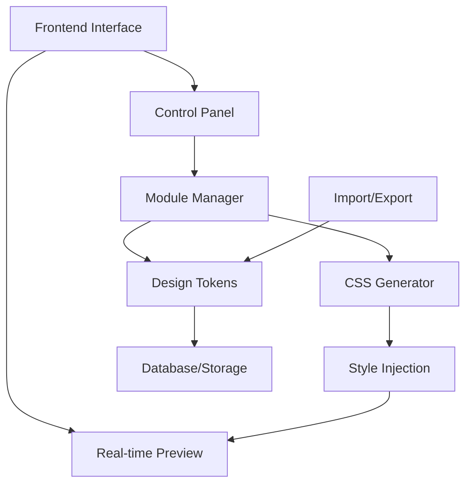
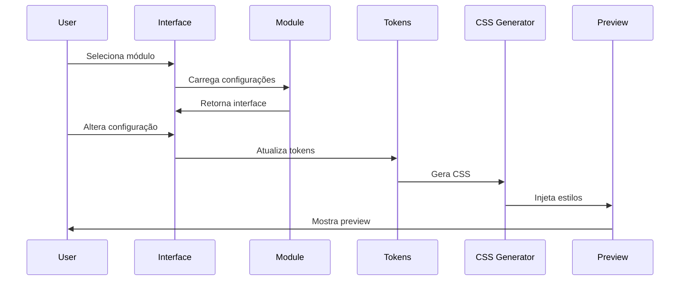
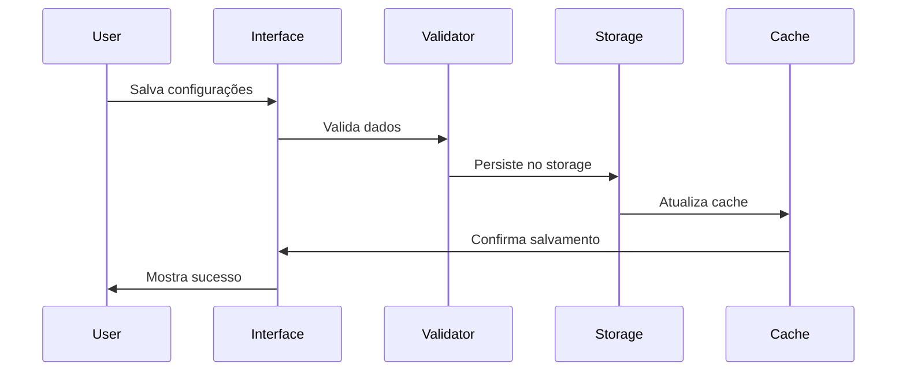
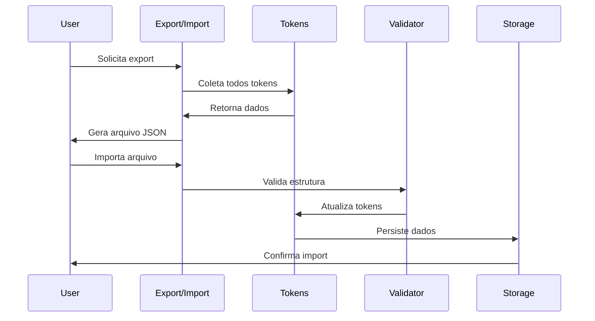

# 📋 PRD - Design System CCT (Custom Customizer Toolkit)

> **Product Requirements Document para reimplementação em outras linguagens/frameworks**

## 🎯 Visão Geral do Produto

### 📊 **Resumo Executivo**

O **Design System CCT** é uma plataforma de personalização visual avançada que permite aos usuários configurar todos os aspectos visuais de uma aplicação web através de uma interface intuitiva com preview em tempo real. O sistema é modular, extensível e focado em performance.

### 🎪 **Problema a Resolver**

- **Personalização limitada** em sistemas tradicionais
- **Falta de preview em tempo real** durante configuração
- **Inconsistência visual** entre diferentes seções
- **Dificuldade técnica** para usuários não desenvolvedores
- **Ausência de design tokens** centralizados
- **Falta de acessibilidade** em ferramentas de design

### 🎯 **Objetivos do Produto**

1. **Democratizar** a personalização visual
2. **Centralizar** configurações de design
3. **Garantir consistência** visual
4. **Otimizar performance** de carregamento
5. **Manter acessibilidade** (WCAG 2.1 AA)
6. **Facilitar manutenção** e escalabilidade

---

## 👥 Personas e Usuários

### 🎨 **Persona 1: Designer/Administrador Visual**
- **Perfil:** Responsável pela identidade visual
- **Necessidades:** Controle total sobre aparência, preview em tempo real
- **Dores:** Ferramentas complexas, falta de preview
- **Objetivos:** Criar experiências visuais consistentes

### 👤 **Persona 2: Usuário Final/Editor**
- **Perfil:** Gerencia conteúdo sem conhecimento técnico
- **Necessidades:** Interface simples, mudanças seguras
- **Dores:** Medo de "quebrar" o site
- **Objetivos:** Personalizar sem riscos

### 👨‍💻 **Persona 3: Desenvolvedor/Integrador**
- **Perfil:** Implementa e mantém o sistema
- **Necessidades:** APIs claras, documentação completa
- **Dores:** Sistemas mal documentados, código legado
- **Objetivos:** Implementação eficiente e manutenível

---

## 🏗️ Arquitetura do Sistema

### 🔧 **Componentes Principais**



### 📦 **Módulos do Sistema**

1. **Core Engine** - Gerenciamento central
2. **Module Manager** - Carregamento dinâmico de módulos
3. **Token System** - Gerenciamento de design tokens
4. **CSS Generator** - Geração dinâmica de estilos
5. **Preview Engine** - Atualização em tempo real
6. **Storage Manager** - Persistência de configurações
7. **Import/Export** - Backup e migração
8. **Security Layer** - Validação e sanitização

---

## 🎨 Especificações dos Módulos

### 🎯 **1. Sistema de Cores**

#### **Funcionalidades Principais**
- Gerenciamento de paletas de cores
- Color picker avançado (HSL, RGB, HEX)
- Verificador de acessibilidade (contraste)
- Paletas predefinidas
- Geração automática de variações

#### **Estrutura de Dados**
```json
{
  "colors": {
    "palettes": {
      "primary": {
        "main": "#0066CC",
        "light": "#3388DD",
        "dark": "#004499",
        "contrast": "#FFFFFF"
      },
      "secondary": {
        "main": "#FF6600",
        "light": "#FF8833",
        "dark": "#CC4400",
        "contrast": "#FFFFFF"
      },
      "neutral": {
        "white": "#FFFFFF",
        "gray-50": "#F8F9FA",
        "gray-100": "#E9ECEF",
        "gray-200": "#DEE2E6",
        "gray-300": "#CED4DA",
        "gray-400": "#ADB5BD",
        "gray-500": "#6C757D",
        "gray-600": "#495057",
        "gray-700": "#343A40",
        "gray-800": "#212529",
        "gray-900": "#000000"
      }
    },
    "accessibility": {
      "contrast_ratio_aa": 4.5,
      "contrast_ratio_aaa": 7.0,
      "check_enabled": true
    }
  }
}
```

#### **APIs Necessárias**
```typescript
interface ColorAPI {
  setPalette(name: string, colors: ColorPalette): void;
  getPalette(name: string): ColorPalette;
  checkContrast(foreground: string, background: string): number;
  generateVariations(baseColor: string): ColorVariations;
  exportPalette(name: string): string;
  importPalette(data: string): boolean;
}
```

### 🔤 **2. Sistema de Tipografia**

#### **Funcionalidades Principais**
- Integração com Google Fonts (800+ fontes)
- Font pairing inteligente
- Configurações avançadas (weight, style, spacing)
- Preview tipográfico em tempo real
- Otimização de carregamento

#### **Estrutura de Dados**
```json
{
  "typography": {
    "fonts": {
      "primary": {
        "family": "Roboto",
        "variants": ["300", "400", "500", "700"],
        "display": "swap",
        "preload": true
      },
      "secondary": {
        "family": "Open Sans",
        "variants": ["400", "600"],
        "display": "swap",
        "preload": false
      }
    },
    "scales": {
      "base_size": 16,
      "ratio": 1.25,
      "sizes": {
        "xs": "0.75rem",
        "sm": "0.875rem",
        "base": "1rem",
        "lg": "1.125rem",
        "xl": "1.25rem",
        "2xl": "1.5rem",
        "3xl": "1.875rem",
        "4xl": "2.25rem",
        "5xl": "3rem"
      }
    },
    "line_heights": {
      "tight": 1.25,
      "normal": 1.5,
      "relaxed": 1.75
    },
    "letter_spacing": {
      "tight": "-0.025em",
      "normal": "0",
      "wide": "0.025em"
    }
  }
}
```

### 🏗️ **3. Sistema de Layout**

#### **Funcionalidades Principais**
- Grid system responsivo
- Containers configuráveis
- 4 tipos de layout (single, two-column, three-column)
- Breakpoints customizáveis
- Espaçamentos consistentes

#### **Estrutura de Dados**
```json
{
  "layout": {
    "grid": {
      "columns": 12,
      "gap": "1rem",
      "max_width": "1200px",
      "container_padding": "1rem"
    },
    "breakpoints": {
      "mobile": "768px",
      "tablet": "1024px",
      "desktop": "1200px",
      "wide": "1400px"
    },
    "spacing": {
      "xs": "0.25rem",
      "sm": "0.5rem",
      "md": "1rem",
      "lg": "1.5rem",
      "xl": "3rem",
      "2xl": "4rem",
      "3xl": "6rem"
    },
    "layouts": {
      "single": {
        "columns": 1,
        "sidebar": false
      },
      "two_column_right": {
        "columns": 2,
        "sidebar": "right",
        "main_width": "70%",
        "sidebar_width": "30%"
      },
      "two_column_left": {
        "columns": 2,
        "sidebar": "left",
        "main_width": "70%",
        "sidebar_width": "30%"
      },
      "three_column": {
        "columns": 3,
        "main_width": "50%",
        "sidebar_left_width": "25%",
        "sidebar_right_width": "25%"
      }
    }
  }
}
```

### 🎭 **4. Sistema de Ícones**

#### **Funcionalidades Principais**
- Biblioteca SVG com 500+ ícones
- Upload de ícones personalizados
- Gerenciador visual
- Categorização e busca
- Sistema de favoritos

#### **Estrutura de Dados**
```json
{
  "icons": {
    "library": {
      "default": {
        "home": "<svg>...</svg>",
        "user": "<svg>...</svg>",
        "settings": "<svg>...</svg>"
      },
      "custom": {
        "logo-uenf": "<svg>...</svg>",
        "icon-custom": "<svg>...</svg>"
      }
    },
    "categories": {
      "navigation": ["home", "menu", "arrow"],
      "social": ["facebook", "twitter", "instagram"],
      "interface": ["settings", "user", "search"]
    },
    "settings": {
      "default_size": "24px",
      "default_color": "currentColor",
      "stroke_width": 2
    }
  }
}
```

### ✨ **5. Sistema de Animações**

#### **Funcionalidades Principais**
- Micro-interações suaves
- Transições configuráveis
- Performance mode para mobile
- Easing functions personalizadas
- Controle de duração e delay

#### **Estrutura de Dados**
```json
{
  "animations": {
    "global": {
      "enabled": true,
      "performance_mode": false,
      "reduce_motion_respect": true
    },
    "transitions": {
      "duration": {
        "fast": "150ms",
        "normal": "300ms",
        "slow": "500ms"
      },
      "easing": {
        "ease": "ease",
        "ease_in": "ease-in",
        "ease_out": "ease-out",
        "ease_in_out": "ease-in-out",
        "custom": "cubic-bezier(0.4, 0, 0.2, 1)"
      }
    },
    "effects": {
      "fade": {
        "duration": "300ms",
        "easing": "ease-in-out"
      },
      "slide": {
        "duration": "300ms",
        "easing": "ease-out",
        "distance": "20px"
      },
      "scale": {
        "duration": "200ms",
        "easing": "ease-out",
        "scale": 1.05
      }
    }
  }
}
```

### 🌈 **6. Sistema de Gradientes**

#### **Funcionalidades Principais**
- Gradientes predefinidos profissionais
- Gerador personalizado
- Múltiplas direções e tipos
- Preview em tempo real
- Exportação CSS

#### **Estrutura de Dados**
```json
{
  "gradients": {
    "presets": {
      "sunset": {
        "type": "linear",
        "direction": "45deg",
        "stops": [
          {"color": "#FF6B6B", "position": "0%"},
          {"color": "#4ECDC4", "position": "100%"}
        ]
      },
      "ocean": {
        "type": "linear",
        "direction": "135deg",
        "stops": [
          {"color": "#667eea", "position": "0%"},
          {"color": "#764ba2", "position": "100%"}
        ]
      }
    },
    "custom": {},
    "settings": {
      "default_type": "linear",
      "default_direction": "45deg"
    }
  }
}
```

### 🌓 **7. Modo Escuro/Claro**

#### **Funcionalidades Principais**
- Toggle automático baseado em preferências
- Configurações personalizadas para cada modo
- Transições suaves
- Persistência de preferências

#### **Estrutura de Dados**
```json
{
  "dark_mode": {
    "enabled": true,
    "default_mode": "auto",
    "auto_switch": {
      "enabled": true,
      "sunrise": "06:00",
      "sunset": "18:00"
    },
    "themes": {
      "light": {
        "background": "#FFFFFF",
        "surface": "#F8F9FA",
        "text_primary": "#212529",
        "text_secondary": "#6C757D"
      },
      "dark": {
        "background": "#121212",
        "surface": "#1E1E1E",
        "text_primary": "#FFFFFF",
        "text_secondary": "#B3B3B3"
      }
    },
    "transition": {
      "duration": "300ms",
      "easing": "ease-in-out"
    }
  }
}
```

### 🔳 **8. Sistema de Sombras**

#### **Funcionalidades Principais**
- Elevation system com depth layers
- Sombras predefinidas (SM, MD, LG, XL)
- Configuração personalizada
- Material Design compliance

#### **Estrutura de Dados**
```json
{
  "shadows": {
    "elevation": {
      "0": "none",
      "1": "0 1px 3px rgba(0,0,0,0.12), 0 1px 2px rgba(0,0,0,0.24)",
      "2": "0 3px 6px rgba(0,0,0,0.16), 0 3px 6px rgba(0,0,0,0.23)",
      "3": "0 10px 20px rgba(0,0,0,0.19), 0 6px 6px rgba(0,0,0,0.23)",
      "4": "0 14px 28px rgba(0,0,0,0.25), 0 10px 10px rgba(0,0,0,0.22)",
      "5": "0 19px 38px rgba(0,0,0,0.30), 0 15px 12px rgba(0,0,0,0.22)"
    },
    "custom": {
      "x_offset": "0px",
      "y_offset": "4px",
      "blur": "8px",
      "spread": "0px",
      "color": "rgba(0,0,0,0.1)",
      "inset": false
    }
  }
}
```

### 📱 **9. Responsive Breakpoints**

#### **Funcionalidades Principais**
- Breakpoints customizáveis
- Presets populares (Bootstrap, Tailwind, Material)
- Preview responsivo em tempo real
- Configurações por dispositivo

#### **Estrutura de Dados**
```json
{
  "breakpoints": {
    "active_preset": "bootstrap",
    "presets": {
      "bootstrap": {
        "xs": "0px",
        "sm": "576px",
        "md": "768px",
        "lg": "992px",
        "xl": "1200px",
        "xxl": "1400px"
      },
      "tailwind": {
        "sm": "640px",
        "md": "768px",
        "lg": "1024px",
        "xl": "1280px",
        "2xl": "1536px"
      },
      "material": {
        "xs": "0px",
        "sm": "600px",
        "md": "960px",
        "lg": "1280px",
        "xl": "1920px"
      }
    },
    "custom": {},
    "device_settings": {
      "mobile": {
        "font_scale": 0.9,
        "spacing_scale": 0.8,
        "performance_mode": true
      },
      "tablet": {
        "font_scale": 1.0,
        "spacing_scale": 1.0,
        "performance_mode": false
      },
      "desktop": {
        "font_scale": 1.0,
        "spacing_scale": 1.0,
        "performance_mode": false
      }
    }
  }
}
```

### 🎯 **10. Design Tokens**

#### **Funcionalidades Principais**
- Sistema centralizado de tokens
- 6 categorias organizadas
- Exportação/Importação JSON
- Variáveis CSS automáticas
- Sincronização entre módulos

#### **Estrutura de Dados**
```json
{
  "design_tokens": {
    "colors": {
      "primary": "#0066CC",
      "secondary": "#004499",
      "accent": "#FF6600"
    },
    "typography": {
      "font_family_primary": "Roboto",
      "font_family_secondary": "Open Sans",
      "font_size_base": "16px",
      "line_height_base": "1.5"
    },
    "spacing": {
      "unit": "8px",
      "xs": "4px",
      "sm": "8px",
      "md": "16px",
      "lg": "24px",
      "xl": "32px"
    },
    "borders": {
      "radius_sm": "4px",
      "radius_md": "8px",
      "radius_lg": "12px",
      "width_thin": "1px",
      "width_thick": "2px"
    },
    "shadows": {
      "sm": "0 1px 3px rgba(0,0,0,0.12)",
      "md": "0 4px 6px rgba(0,0,0,0.16)",
      "lg": "0 10px 20px rgba(0,0,0,0.19)"
    },
    "animations": {
      "duration_fast": "150ms",
      "duration_normal": "300ms",
      "duration_slow": "500ms",
      "easing_default": "ease-in-out"
    }
  }
}
```

### 🧩 **11. Biblioteca de Padrões**

#### **Funcionalidades Principais**
- Seções predefinidas (Hero, FAQ, Pricing, Team, Portfolio)
- Configuração visual de cada seção
- Templates responsivos
- Customização avançada

#### **Estrutura de Dados**
```json
{
  "patterns": {
    "hero": {
      "template": "hero_centered",
      "background_type": "gradient",
      "background_value": "sunset",
      "text_alignment": "center",
      "button_style": "primary",
      "height": "60vh"
    },
    "faq": {
      "template": "accordion",
      "columns": 1,
      "expand_first": true,
      "icon_style": "plus_minus"
    },
    "pricing": {
      "template": "cards",
      "columns": 3,
      "highlight_plan": "middle",
      "currency": "R$",
      "billing_period": "month"
    },
    "team": {
      "template": "grid",
      "columns": 4,
      "image_shape": "circle",
      "show_social": true
    },
    "portfolio": {
      "template": "masonry",
      "columns": 3,
      "filter_enabled": true,
      "lightbox_enabled": true
    }
  }
}
```

### 📝 **12. Editor CSS**

#### **Funcionalidades Principais**
- Syntax highlighting para CSS
- Autocomplete e validação
- Backup automático
- Minificação automática
- Error handling

#### **Estrutura de Dados**
```json
{
  "css_editor": {
    "settings": {
      "syntax_highlighting": true,
      "autocomplete": true,
      "auto_backup": true,
      "backup_interval": 300000,
      "minify_output": true,
      "validate_css": true
    },
    "custom_css": "",
    "backups": [
      {
        "timestamp": "2024-01-15T10:30:00Z",
        "css": "/* backup content */"
      }
    ],
    "errors": [],
    "warnings": []
  }
}
```

---

## 🔄 Fluxos de Trabalho

### 🎨 **Fluxo de Personalização**



### 💾 **Fluxo de Persistência**



### 📤 **Fluxo de Export/Import**



---

## 🔧 Especificações Técnicas

### 📊 **Requisitos de Performance**

- **Tempo de carregamento inicial:** < 2 segundos
- **Tempo de resposta do preview:** < 100ms
- **Tamanho do bundle JavaScript:** < 500KB (gzipped)
- **Tamanho do CSS gerado:** < 100KB
- **Suporte a dispositivos:** Mobile, Tablet, Desktop
- **Navegadores suportados:** Chrome 90+, Firefox 88+, Safari 14+, Edge 90+

### 🔒 **Requisitos de Segurança**

- **Sanitização** de todos os inputs
- **Validação** de dados no frontend e backend
- **Escape** de outputs para prevenir XSS
- **Rate limiting** para APIs
- **Autenticação** e autorização adequadas
- **Logs** de auditoria para mudanças

### ♿ **Requisitos de Acessibilidade**

- **WCAG 2.1 AA** compliance
- **Navegação por teclado** completa
- **Screen reader** support
- **Alto contraste** disponível
- **Redução de movimento** respeitada
- **Foco visível** em todos os elementos interativos

### 📱 **Requisitos de Responsividade**

- **Mobile-first** approach
- **Breakpoints** configuráveis
- **Touch-friendly** interfaces
- **Viewport** meta tag adequada
- **Imagens** responsivas
- **Performance** otimizada para mobile

---

## 🛠️ Implementação Técnica

### 🏗️ **Arquitetura Recomendada**

#### **Frontend (SPA)**
```typescript
// Estrutura de componentes
interface CCTModule {
  id: string;
  name: string;
  version: string;
  dependencies: string[];
  
  init(): Promise<void>;
  render(): HTMLElement;
  updatePreview(settings: any): void;
  getSettings(): any;
  setSettings(settings: any): void;
  validate(settings: any): ValidationResult;
  destroy(): void;
}

// Core Engine
class CCTCore {
  private modules: Map<string, CCTModule> = new Map();
  private tokens: DesignTokens;
  private preview: PreviewEngine;
  private storage: StorageManager;
  
  async loadModule(moduleId: string): Promise<CCTModule> {
    // Lazy loading de módulos
  }
  
  registerModule(module: CCTModule): void {
    // Registro de módulos
  }
  
  updateTokens(tokens: Partial<DesignTokens>): void {
    // Atualização de tokens
  }
}
```

#### **Backend (API REST)**
```typescript
// Endpoints principais
interface CCTAPI {
  // Configurações
  GET    /api/settings
  POST   /api/settings
  PUT    /api/settings/:id
  DELETE /api/settings/:id
  
  // Módulos
  GET    /api/modules
  GET    /api/modules/:id
  
  // Design Tokens
  GET    /api/tokens
  POST   /api/tokens
  PUT    /api/tokens
  
  // Import/Export
  POST   /api/export
  POST   /api/import
  
  // CSS Generation
  POST   /api/generate-css
  
  // Validation
  POST   /api/validate
}
```

### 💾 **Estrutura de Banco de Dados**

```sql
-- Tabela principal de configurações
CREATE TABLE cct_settings (
  id UUID PRIMARY KEY,
  user_id UUID NOT NULL,
  module_id VARCHAR(50) NOT NULL,
  settings JSONB NOT NULL,
  version VARCHAR(10) NOT NULL,
  created_at TIMESTAMP DEFAULT NOW(),
  updated_at TIMESTAMP DEFAULT NOW(),
  
  INDEX idx_user_module (user_id, module_id),
  INDEX idx_updated_at (updated_at)
);

-- Tabela de design tokens
CREATE TABLE cct_design_tokens (
  id UUID PRIMARY KEY,
  user_id UUID NOT NULL,
  category VARCHAR(50) NOT NULL,
  tokens JSONB NOT NULL,
  version VARCHAR(10) NOT NULL,
  created_at TIMESTAMP DEFAULT NOW(),
  updated_at TIMESTAMP DEFAULT NOW(),
  
  INDEX idx_user_category (user_id, category)
);

-- Tabela de backups
CREATE TABLE cct_backups (
  id UUID PRIMARY KEY,
  user_id UUID NOT NULL,
  backup_type VARCHAR(20) NOT NULL, -- 'manual', 'auto'
  data JSONB NOT NULL,
  created_at TIMESTAMP DEFAULT NOW(),
  
  INDEX idx_user_created (user_id, created_at)
);

-- Tabela de logs de auditoria
CREATE TABLE cct_audit_logs (
  id UUID PRIMARY KEY,
  user_id UUID NOT NULL,
  action VARCHAR(50) NOT NULL,
  module_id VARCHAR(50),
  old_data JSONB,
  new_data JSONB,
  ip_address INET,
  user_agent TEXT,
  created_at TIMESTAMP DEFAULT NOW(),
  
  INDEX idx_user_action (user_id, action),
  INDEX idx_created_at (created_at)
);
```

### 🔄 **Estado Global (Redux/Vuex/Context)**

```typescript
interface CCTState {
  // Configurações atuais
  settings: {
    [moduleId: string]: any;
  };
  
  // Design tokens
  tokens: DesignTokens;
  
  // Estado da UI
  ui: {
    activeModule: string | null;
    previewMode: 'desktop' | 'tablet' | 'mobile';
    sidebarOpen: boolean;
    loading: boolean;
    errors: string[];
  };
  
  // Cache
  cache: {
    modules: Map<string, CCTModule>;
    css: string;
    lastUpdate: number;
  };
}

// Actions
interface CCTActions {
  loadModule(moduleId: string): Promise<void>;
  updateSettings(moduleId: string, settings: any): void;
  updateTokens(tokens: Partial<DesignTokens>): void;
  generateCSS(): Promise<string>;
  saveSettings(): Promise<void>;
  exportSettings(): Promise<string>;
  importSettings(data: string): Promise<void>;
}
```

---

## 🧪 Estratégia de Testes

### 🔍 **Tipos de Teste**

1. **Testes Unitários** (70%)
   - Funções puras
   - Validadores
   - Utilitários
   - Componentes isolados

2. **Testes de Integração** (20%)
   - Fluxos entre módulos
   - APIs
   - Persistência
   - Preview engine

3. **Testes E2E** (10%)
   - Fluxos completos de usuário
   - Cross-browser
   - Performance
   - Acessibilidade

### 🧪 **Casos de Teste Críticos**

```typescript
// Exemplo de testes unitários
describe('CCTColors', () => {
  test('should calculate contrast ratio correctly', () => {
    expect(calculateContrast('#000000', '#FFFFFF')).toBe(21);
    expect(calculateContrast('#0066CC', '#FFFFFF')).toBeGreaterThan(4.5);
  });
  
  test('should generate valid CSS variables', () => {
    const palette = { primary: '#0066CC', secondary: '#004499' };
    const css = generateCSSVariables(palette);
    expect(css).toContain('--color-primary: #0066CC');
  });
  
  test('should validate color formats', () => {
    expect(isValidColor('#FF0000')).toBe(true);
    expect(isValidColor('rgb(255, 0, 0)')).toBe(true);
    expect(isValidColor('invalid')).toBe(false);
  });
});

// Exemplo de testes E2E
describe('Color Module E2E', () => {
  test('should update preview when color changes', async () => {
    await page.goto('/customizer');
    await page.click('[data-module="colors"]');
    await page.fill('[data-setting="primary"]', '#FF0000');
    
    const previewColor = await page.evaluate(() => {
      return getComputedStyle(document.querySelector('.preview-element'))
        .getPropertyValue('--color-primary');
    });
    
    expect(previewColor.trim()).toBe('#FF0000');
  });
});
```

---

## 📈 Métricas e Analytics

### 📊 **KPIs do Produto**

1. **Adoção**
   - Número de usuários ativos
   - Frequência de uso
   - Módulos mais utilizados
   - Tempo de sessão

2. **Engagement**
   - Configurações salvas por sessão
   - Exports realizados
   - Módulos explorados
   - Retorno de usuários

3. **Performance**
   - Tempo de carregamento
   - Tempo de resposta do preview
   - Taxa de erro
   - Satisfação do usuário

4. **Qualidade**
   - Bugs reportados
   - Tempo de resolução
   - Acessibilidade score
   - Performance score

### 📈 **Eventos de Tracking**

```typescript
interface CCTAnalytics {
  // Eventos de uso
  trackModuleOpen(moduleId: string): void;
  trackSettingChange(moduleId: string, setting: string, value: any): void;
  trackPreviewUpdate(moduleId: string, duration: number): void;
  trackSave(moduleId: string, settingsCount: number): void;
  trackExport(format: string, size: number): void;
  trackImport(format: string, success: boolean): void;
  
  // Eventos de performance
  trackLoadTime(moduleId: string, duration: number): void;
  trackError(error: Error, context: string): void;
  trackPerformanceMetrics(metrics: PerformanceMetrics): void;
  
  // Eventos de UX
  trackUserFlow(flow: string, step: number, success: boolean): void;
  trackAccessibilityUsage(feature: string): void;
  trackMobileUsage(device: string, viewport: string): void;
}
```

---

## 🚀 Roadmap e Evolução

### 📅 **Versão 1.0 (MVP)**
- ✅ 12 módulos básicos
- ✅ Preview em tempo real
- ✅ Export/Import
- ✅ Design tokens
- ✅ Responsividade

### 📅 **Versão 1.1 (Melhorias)**
- 🔄 Temas predefinidos
- 🔄 Colaboração em tempo real
- 🔄 Histórico de versões
- 🔄 API pública
- 🔄 Plugins de terceiros

### 📅 **Versão 1.2 (Avançado)**
- 🔄 AI-powered suggestions
- 🔄 A/B testing integration
- 🔄 Advanced analytics
- 🔄 White-label solution
- 🔄 Enterprise features

### 📅 **Versão 2.0 (Next Gen)**
- 🔄 Visual editor drag & drop
- 🔄 Component library
- 🔄 Design system generator
- 🔄 Multi-brand support
- 🔄 Advanced automation

---

## 📞 Suporte e Manutenção

### 🔧 **Estratégia de Manutenção**

1. **Atualizações de Segurança** (Críticas)
   - Patches imediatos
   - Notificação automática
   - Rollback automático se necessário

2. **Correções de Bug** (Alta prioridade)
   - Fix em 24-48h
   - Testes automatizados
   - Deploy gradual

3. **Melhorias de Performance** (Média prioridade)
   - Otimizações mensais
   - Monitoramento contínuo
   - Benchmarks regulares

4. **Novas Funcionalidades** (Baixa prioridade)
   - Releases trimestrais
   - Beta testing
   - Feedback da comunidade

### 📋 **SLA (Service Level Agreement)**

- **Uptime:** 99.9%
- **Tempo de resposta:** < 200ms (95th percentile)
- **Suporte crítico:** 2h
- **Suporte normal:** 24h
- **Backup:** Diário com retenção de 30 dias

---

## 📄 Conclusão

Este PRD fornece uma especificação completa para reimplementação do **Design System CCT** em qualquer linguagem ou framework. A arquitetura modular, APIs bem definidas e estruturas de dados padronizadas facilitam a portabilidade e manutenção do sistema.

### 🎯 **Próximos Passos para Implementação**

1. **Escolha da Stack Tecnológica**
2. **Setup do Ambiente de Desenvolvimento**
3. **Implementação do Core Engine**
4. **Desenvolvimento dos Módulos Prioritários**
5. **Integração do Sistema de Preview**
6. **Testes e Validação**
7. **Deploy e Monitoramento**

---

**📋 Este PRD é um documento vivo e deve ser atualizado conforme a evolução do produto.**

*© 2024 Universidade Estadual do Norte Fluminense - UENF*